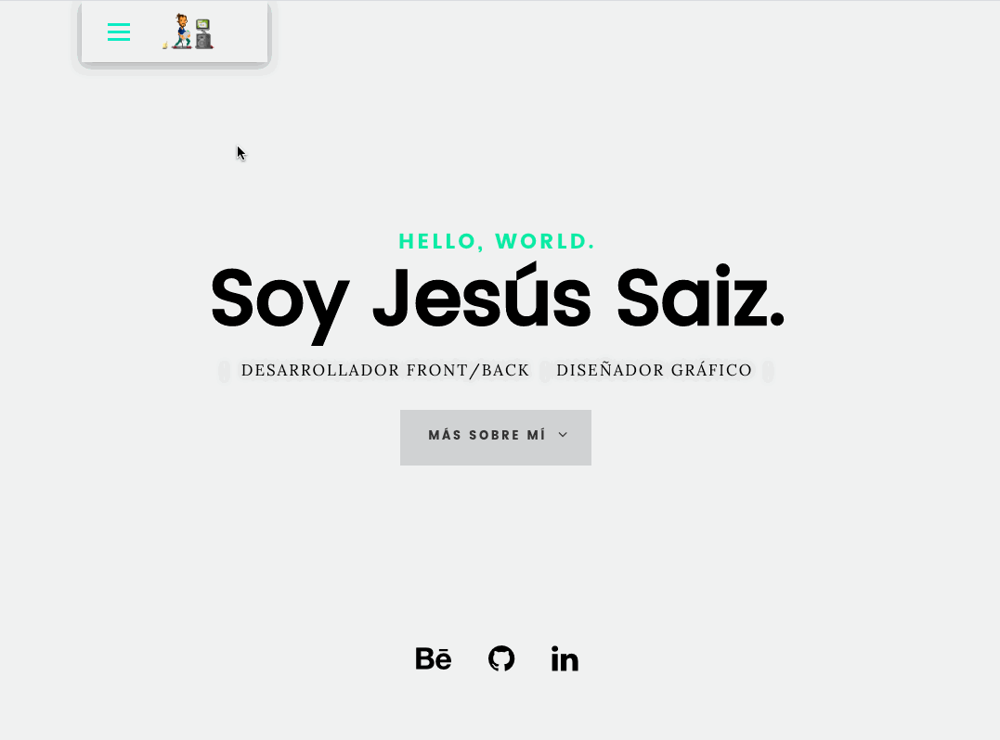

# Personal Portfolio with Angular
It´s a tiny example of my works create with Angular 8

# LINK
https://jesusaiz.github.io/portfolioWorks/

# Images of the Portfolio

This project was generated with [Angular CLI](https://github.com/angular/angular-cli) version 8.3.13.

# Development server

Run `ng serve` for a dev server. Navigate to `http://localhost:4200/`. The app will automatically reload if you change any of the source files.
